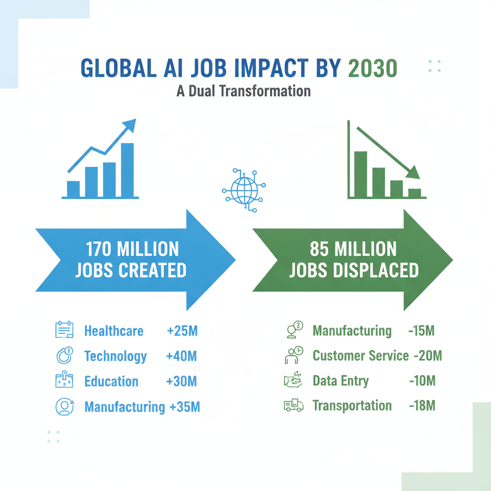
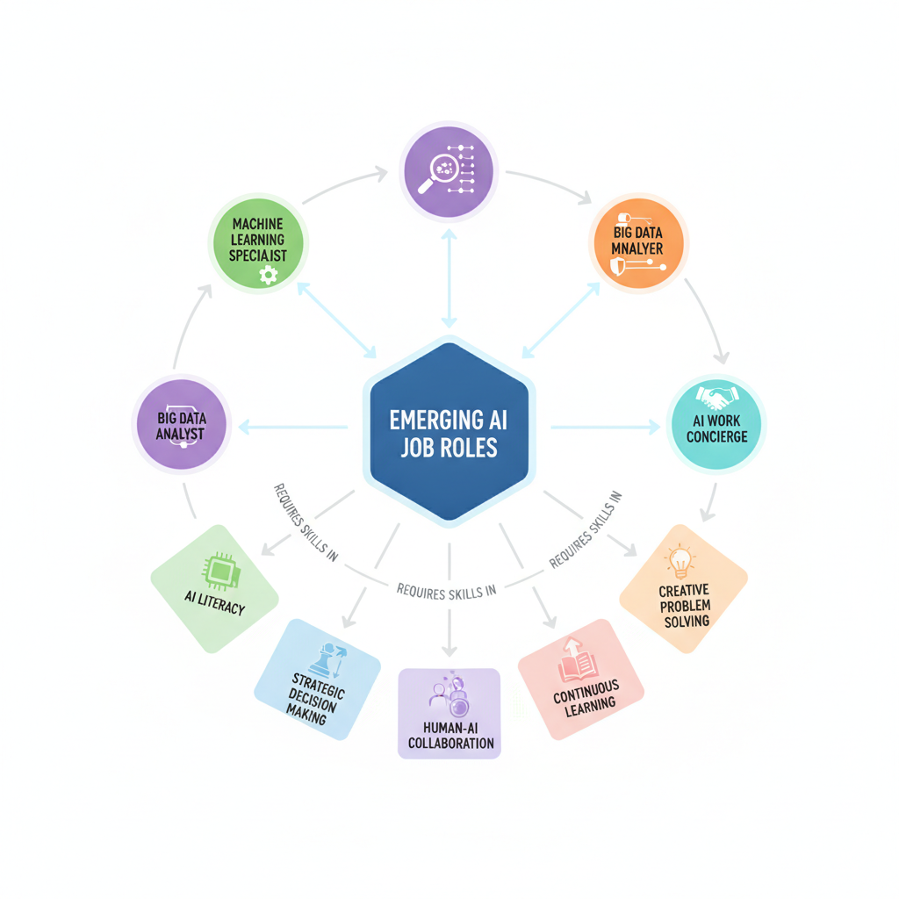
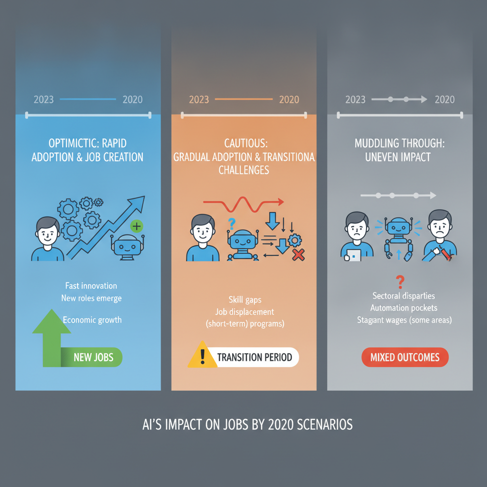

# How AI Will Impact Jobs in 2030: Predictions and Realities

## Overview of AI's Expected Impact on Job Markets by 2030

Leading organizations and reports collectively forecast significant shifts in the global job market by 2030 due to AI adoption. The World Economic Forum (WEF) estimates AI could create approximately 170 million new jobs worldwide, while displacing about 85 million roles, resulting in a net positive impact but with extensive workforce rebalancing ([Technology Magazine](https://technologymagazine.com/articles/wef-report-the-impact-of-ai-driving-170m-new-jobs-by-2030)). McKinsey and other analysts suggest a similarly transformative effect, indicating that up to one-third of the workforce may need to switch occupations as automation and AI reshape job functions ([Innopharma Education](https://www.innopharmaeducation.com/blog/the-impact-of-ai-on-job-roles-workforce-and-employment-what-you-need-to-know)).

*Projected job creation and displacement globally by AI in 2030 with sector highlights.*

### Sector-Specific Opportunities

Certain sectors are poised to see pronounced AI-driven job creation:

- **Healthcare:** Growth in AI-powered diagnostics, personalized medicine, and health data analysis will create roles in AI system management and medical informatics.
- **Manufacturing:** Automation and robot collaboration will transform factory operations, spawning new maintenance, programming, and quality assurance positions.
- **Finance:** AI-enabled risk assessment, fraud detection, and financial advising will demand specialists who can interpret and guide AI outputs.
- **Technology and Data Services:** Cloud computing, AI system development, and data analysis specialists will remain critical as AI adoption deepens.
- **Education and Training:** AI will generate demand for educators skilled in digital literacy and AI-augmented learning methodologies.

### Transformation Over Replacement

The dominant trend across reports is that AI will primarily transform jobs rather than simply replace them. Rather than wholesale elimination, many roles will evolve to incorporate AI tools, requiring workers to adapt to augmented workflows ([WEF Report](https://reports.weforum.org/docs/WEF_Four_Futures_for_Jobs_in_the_New_Economy_AI_and_Talent_in_2030_2025.pdf)). This transformation entails:

- Increased emphasis on digital and AI literacy.
- New hybrid roles combining technical and domain expertise.
- Greater reliance on continuous upskilling and reskilling.

### Quantitative Forecasts and Uncertainty

Estimates for job displacement due to AI by 2030 vary widely: some indicate about 6% of US jobs could be automated ([Forrester Blog](https://www.forrester.com/blogs/ai-and-automation-will-take-6-of-us-jobs-by-2030)), while global figures suggest displacement of tens of millions. Conversely, AI-related job creation is forecasted in the range of 100 to 200 million new roles globally depending on adoption scenarios ([Boterview Statistics](https://boterview.com/a/ai-job-creation-statistics)). These broad ranges reflect:

- Differing assumptions about technology adoption rates.
- Regional economic and regulatory variations.
- The evolving nature of AI capabilities and industry integration.

### Implications for Skills and Hiring

The evolving job landscape requires professionals to focus on adaptable skill sets:

- Proficiency in AI collaboration and interpretation.
- Complementing AI with uniquely human skills such as creativity, empathy, and complex problem solving.
- Understanding domain-specific AI applications to guide ethical and effective use.

Hiring strategies will increasingly prioritize flexibility, digital fluency, and lifelong learning capacity over narrowly specialized skills.

---

This balanced synthesis from multiple research sources highlights that by 2030, AI will reshape the job market through a combination of displacement, creation, and transformation, demanding new skills and adaptable talent strategies across sectors.

## Sectors Most Affected by AI Automation and Job Transformation

AI adoption is transforming the workforce across multiple industries, with some sectors seeing more profound impacts on job roles and employment structures by 2030. Key industries experiencing significant AI-driven change include healthcare, manufacturing, retail, banking, logistics, and various knowledge work domains.

- **Healthcare** is leveraging AI for diagnostic assistance, patient monitoring, and administrative automation, increasing efficiency but altering roles like medical transcriptionists and basic diagnostic technicians.
- **Manufacturing** utilizes AI-powered robotics and predictive maintenance systems, automating routine assembly line tasks and quality control, which traditionally required manual labor.
- In **retail**, AI is replacing routine roles such as cashiers through self-checkout and automated payment systems, while also enhancing inventory management.
- **Banking and financial services** employ AI for fraud detection, risk assessment, and customer service chatbots, impacting roles from basic financial advisors to data entry clerks.
- The **logistics** sector is automating route planning, warehouse sorting, and shipment tracking, transforming operational roles and increasing reliance on AI-driven analytics.
- **Knowledge work**, including legal research, journalism, and administrative functions, sees AI automating repetitive data analysis and reporting tasks, freeing professionals for higher-level decision-making.

Examples of jobs facing automation predominantly include those with routine, repetitive tasks. These are roles such as:

- Cashiers in retail stores
- Data entry clerks managing large data volumes
- Basic-level financial advisory and loan processing jobs
- Assembly line operators in manufacturing
- Routine customer service representatives in banking and telecom

AI augmentation is not solely substitutive but enables professionals to shift their focus to strategic, creative, and interpersonal tasks. For instance, doctors can devote more time to complex diagnostics and patient interaction as AI handles image analysis; financial advisors can focus on personalized wealth management rather than rote data compilation. This augmentation fosters upskilling and the evolution of job roles rather than wholesale displacement ([WEF Report](https://technologymagazine.com/articles/wef-report-the-impact-of-ai-driving-170m-new-jobs-by-2030)).

Regionally, North America leads in adopting AI workforce automation, driven by extensive investments in AI technologies and supportive regulatory environments. This leadership position accelerates automation in sectors such as finance, healthcare, and logistics. Other regions, while rapidly catching up, face varied adoption rates influenced by infrastructure and workforce readiness ([Research and Markets](https://www.researchandmarkets.com/reports/6091802/ai-in-workforce-automation-market-forecasts)).

The implications for hiring and skill development in affected industries are substantial:

- A growing demand for AI literacy and data skills is essential across sectors.
- Roles increasingly require hybrid skills combining domain expertise with AI tool proficiency.
- Human skills such as critical thinking, creativity, emotional intelligence, and adaptability become differentiators.
- Companies will prioritize continuous learning frameworks to reskill existing employees.
- Job descriptions will shift to emphasize collaboration with AI systems rather than task execution alone.

Overall, AI-driven job transformation by 2030 emphasizes a rebalancing of human and machine work, with routine tasks automated and human workers empowered to engage in more complex, strategic roles. This necessitates proactive workforce planning, training, and adaptive hiring strategies across industries heavily impacted by AI automation ([InnopharmaEducation](https://www.innopharmaeducation.com/blog/the-impact-of-ai-on-job-roles-workforce-and-employment-what-you-need-to-know)).

## New Job Roles and Skills Emerging Due to AI Integration

The integration of AI technologies into workplaces is poised to create new roles and demand evolving skill sets by 2030. AI-related positions will expand beyond traditional tech jobs, encompassing diverse functions essential to managing, enhancing, and collaborating with AI systems.

### Emerging AI-Driven Job Roles

Key new roles anticipated to grow include:

- **Machine Learning Specialists:** Professionals focused on developing and tuning AI models that drive automation and predictive insights.
- **Big Data Analysts:** Experts who interpret vast datasets generated by AI systems to guide business strategy.
- **AI System Managers:** Roles dedicated to overseeing the deployment, integration, and ethical management of AI within enterprises.
- **AI Work Concierges:** A novel category supporting human-AI collaboration, assisting workers in leveraging AI tools effectively and troubleshooting AI-enabled workflows ([Innopharma Education](https://www.innopharmaeducation.com/blog/the-impact-of-ai-on-job-roles-workforce-and-employment-what-you-need-to-know)).

### Necessity for Continuous Learning and Reskilling

As AI automates routine and repetitive tasks, the workforce must pivot towards continuous learning and adaptive reskilling. This shift is crucial to remain relevant in AI-augmented roles. Employers and training programs increasingly emphasize upskilling in AI literacy and technical competencies to keep pace with evolving AI applications ([World Economic Forum](https://reports.weforum.org/docs/WEF_Four_Futures_for_Jobs_in_the_New_Economy_AI_and_Talent_in_2030_2025.pdf)).

### Skills Shifting Toward Strategic and Creative Competencies

The required skill sets are transitioning from purely technical tasks to more complex abilities such as:

- **Strategic Decision-Making:** Leveraging AI insights to guide business choices rather than manual data processing.
- **Human-AI Collaboration:** Effectively integrating AI outputs with human judgement and emotional intelligence.
- **Creative Problem Solving:** Designing innovative approaches that AI alone cannot generate.

These shifts highlight the increasing value of uniquely human skills augmented by AI rather than replaced by it ([AI World Journal](https://aiworldjournal-com.translate.goog/ai-jobs-automation-how-artificial-intelligence-is-reshaping-the-workforce?_x_tr_sl=auto&_x_tr_tl=en&_x_tr_hl=en-US)).

### Democratized Application Development and Flexible Organizational Models

The rise of low-code/no-code AI platforms enables broader participation in AI development, including non-traditional tech roles. This democratization accelerates innovation and necessitates skills in interdisciplinary collaboration and agile project management.

Flexible organizational structures 	7 emphasizing cross-functional teams and decentralized decision-making 	7 are becoming the norm. These models accommodate human-AI partnerships and facilitate dynamic adaptation to AI-driven changes in workflows ([Dion Hinchcliffe](https://dionhinchcliffe.com/2024/01/18/a-comprehensive-guide-to-the-future-of-work-in-2030)).

### Projected Growth and Implications for Training

Forecasts indicate AI-related career fields will experience substantial growth through 2030. Estimates suggest AI could drive the creation of 170 million new jobs globally, spanning industries and skill levels ([Technology Magazine](https://technologymagazine.com/articles/wef-report-the-impact-of-ai-driving-170m-new-jobs-by-2030)).

This growth will require scalable, accessible training programs emphasizing lifelong learning and hybrid skill development	7both technical and interpersonal. Workforce ecosystems must evolve to support talent pipelines equipped to thrive in AI-integrated environments ([Smoothstack](https://smoothstack.com/resource/get-ready-for-2030-what-the-next-gen-workforce-will-look-like-and-how-you-can-prepare)).

*Visualization of emerging AI-driven job roles and the evolving skill sets required by 2030.*

---

The future AI-augmented workplace thus demands a blend of new roles centered on AI management and collaboration, continuous adaptation via reskilling, and an emphasis on strategic and creative human capabilities. These trends underscore a balanced transformation, where AI is a partner in evolving job functions rather than merely a replacement.

## Analyzing Job Displacement: Which Roles Are Most at Risk?

Certain job roles characterized by repetitive, rule-based tasks face the highest vulnerability to AI automation. Positions such as cashiers, data entry clerks, and routine administrative workers are prime examples, as their tasks involve predictable workflows that AI and robotic process automation can efficiently handle. These roles often require minimal complex decision-making or social interaction, making them susceptible to automated solutions that reduce labor costs and increase operational speed ([Innopharma Education](https://www.innopharmaeducation.com/blog/the-impact-of-ai-on-job-roles-workforce-and-employment-what-you-need-to-know)).

Projections of job displacement globally by 2030 are significant. Estimates indicate that up to 85 million jobs could be affected by AI-driven automation, combining both full job losses and partial task replacements. These figures originate from analyses that consider the pace of technological advancement alongside adoption rates across industries ([Davron](https://www.davron.net/ai-job-replacement-statistics-2025-2030); [WEF Report](https://reports.weforum.org/docs/WEF_Four_Futures_for_Jobs_in_the_New_Economy_AI_and_Talent_in_2030_2025.pdf)). However, these numbers do not solely represent outright job eliminations but also encompass the transformation and augmentation of existing roles.

Distinguishing displacement involves recognizing that some jobs will disappear entirely, while others will evolve, integrating AI to enhance productivity. For example, administrative assistants may find their workload shifting from managing schedules manually to overseeing AI-powered organizational tools. This augmentation often increases the need for new skills such as AI literacy, problem-solving, and cross-functional collaboration, rather than eliminating employment altogether ([AI World Journal](https://aiworldjournal-com.translate.goog/ai-jobs-automation-how-artificial-intelligence-is-reshaping-the-workforce?_x_tr_sl=auto&_x_tr_tl=en&_x_tr_hl=en-US)).

There are notable exceptions where AI adoption has not led to reduced headcount. Radiology illustrates this well; rather than replacing radiologists, AI tools assist by automating preliminary image analysis, allowing radiologists to focus on complex diagnostics and patient care. This augmentation often leads to increased demand for specialists who can interpret AI outputs, highlighting that AI can complement rather than substitute skilled roles ([Innopharma Education](https://www.innopharmaeducation.com/blog/the-impact-of-ai-on-job-roles-workforce-and-employment-what-you-need-to-know)).

Economic and social factors also play a crucial role in the pace and extent of job displacement. Factors such as labor market regulations, societal acceptance, retraining infrastructure, and business cost-benefit analyses influence AI adoption rates. In some regions or sectors with strict labor protections or slower technology uptake, displacement may be mitigated. Conversely, in highly competitive environments with low retraining support, rapid automation could exacerbate job losses. Additionally, demographic trends	7including an aging workforce	may increase AI adoption to offset labor shortages ([Forrester](https://www.forrester.com/blogs/ai-and-automation-will-take-6-of-us-jobs-by-2030); [WEF Economic Growth](https://www.weforum.org/stories/economic-growth/four-ways-ai-impact-job-markets)).

Understanding these nuances is critical for developers and tech professionals preparing for the future workforce. Anticipating which roles will disappear, transform, or be augmented by AI informs strategic skill development and hiring priorities aimed at thriving in an AI-integrated job market.

## Scenarios for the Future: Different Outlooks on AI and Work by 2030

The future of AIs impact on jobs by 2030 is envisioned through multiple scenarios, each reflecting different rates of adoption, economic shifts, and societal responses. These contrasting outlooks help stakeholders prepare for a complex landscape of workforce transformation.

### Optimistic Scenarios: Rapid AI Adoption and Job Creation

In the most positive outlooks, rapid AI integration drives significant productivity improvements across industries. AI technologies automate routine tasks, enabling human workers to focus on higher-value activities. According to the World Economic Forum, this surge in efficiency is expected to generate a net increase in employment, potentially creating 170 million new jobs globally by 2030 ([Source](https://technologymagazine.com/articles/wef-report-the-impact-of-ai-driving-170m-new-jobs-by-2030)). New roles often emerge in AI management, oversight, and data science, alongside sectors accelerated by AI-driven innovation. The emphasis is on augmenting human capabilities rather than full replacement, fostering economic growth that supports job creation.

### Cautious or Incremental Progress Scenarios: Workforce Adaptation Challenges

More conservative scenarios assume gradual AI adoption constrained by technical, economic, or regulatory factors. In these models, automation replaces certain job functions slower, allowing time for workforce adaptation but also posing challenges in retraining and skill development ([Source](https://www.innopharmaeducation.com/blog/the-impact-of-ai-on-job-roles-workforce-and-employment-what-you-need-to-know)). Many workers may face transitional unemployment or skills mismatch, especially in mid-skill jobs where AI can take over some tasks but not entire roles. The pace of innovation and investment in reskilling programs becomes crucial to smooth this adjustment period.

### The Muddling Through Scenario: Uneven and Gradual AI Impact

A prevalent view among analysts envisions a "muddling through" future, where AIs effect on employment is neither revolutionary nor negligible. This scenario predicts a patchwork of outcomessome industries and regions experience major disruptions, while others see minimal impact ([Source](https://jfsdigital.org/wp-content/uploads/2017/01/JFS212Final%EF%BC%88%E5%B7%B2%E6%8B%96%E7%A7%BB%EF%BC%89-6.pdf)). Job displacement and creation occur unevenly, reflecting local economic structures, sector-specific AI readiness, and workforce demographics. Policy intervention and corporate strategies vary, complicating a unified response to workforce challenges.

### Impact of Adoption Rates and Regulatory Environments

The degree to which AI reshapes jobs depends heavily on adoption speed and regulatory frameworks. Rapid adoption in permissive regulatory settings can accelerate automation, increasing displacement risks but also innovation-led employment. Conversely, stringent regulations may slow AI uptake, reducing short-term disruption but potentially hindering competitive gains ([Source](https://www.davron.net/ai-job-replacement-statistics-2025-2030)). Governments adopting proactive policies focused on data privacy, ethical AI use, and workforce protections are better positioned to balance economic benefits with social stability.

### Preparing for Each Scenario: Organizational and Governmental Responses

To navigate these scenarios, organizations and governments must adopt flexible strategies:

- **Skills Training and Lifelong Learning:** Invest in continuous reskilling programs aligned with AI-augmented job roles.
- **Workforce Planning:** Use labor market analytics to anticipate shifts and guide workforce transition support.
- **Regulatory Frameworks:** Develop adaptive policies that promote innovation while protecting displaced workers.
- **AI Governance:** Implement ethical AI deployment practices that include human oversight and transparency.

By preparing for a range of futureswhether rapid growth, gradual adjustment, or uneven changestakeholders can better manage the risks and opportunities AI presents for employment in 2030 ([Source](https://www.weforum.org/stories/economic-growth/four-ways-ai-impact-job-markets)).

These scenarios stress that the AI-job relationship is dynamic and multifaceted, highlighting the need for balanced, evidence-based approaches to workforce transformations ahead.

## Implications for Hiring, Workforce Strategy, and Developer Community

As AI continues to reshape the labor market toward 2030, companies must fundamentally evolve their hiring and workforce strategies. Traditional skill sets are increasingly supplemented or even replaced by AI-related competencies, making continuous learning a critical priority for organizations and individuals alike. Hiring practices are shifting to prioritize candidates with expertise in AI technologies, data analysis, and machine learning frameworks, alongside adaptive capabilities for lifelong learning ([Source](https://www.innopharmaeducation.com/blog/the-impact-of-ai-on-job-roles-workforce-and-employment-what-you-need-to-know)).

An emerging focus is on human-AI collaboration skills. Beyond technical prowess, employees who can strategically integrate AI tools into decision-making processes, interpret AI outputs critically, and manage AI-driven workflows bring heightened value. Strategic thinking and problem-solving that complement AIs strengths will be key differentiators. Organizations are thus investing in workforce planning that balances automation efficiencies with human judgment and creativity ([Source](https://www.weforum.org/stories/economic-growth/four-ways-ai-impact-job-markets)).

For developers, preparing for these evolving roles involves broadening their expertise beyond coding to mastery of AI toolkits, automation frameworks, and an understanding of domain-specific knowledge. Interdisciplinary skillscombining software engineering, data science, and business acumenwill be essential. Developers who cultivate the ability to build and optimize AI-powered applications stand to play a pivotal role in augmenting worker productivity and enhancing organizational management systems ([Source](https://www.ibm.com/think/insights/ai-and-the-future-of-work)).

The expanding demand for AI solutions creates significant opportunities for developers, particularly in designing applications that support collaboration between humans and machines, automate routine tasks, and provide actionable insights. This demand signals a growth trajectory in jobs focused on AI ethics, transparency, and system reliability, emphasizing not only technical development but also responsible AI integration ([Source](https://technologymagazine.com/articles/wef-report-the-impact-of-ai-driving-170m-new-jobs-by-2030)).

Finally, the workforce transformation prompted by AI triggers important policy and ethical discussions. Fair labor transitions, reskilling initiatives, and inclusive hiring practices are central to mitigating displacement risks and ensuring equitable access to new roles. Policymakers, educators, and industry leaders must collaborate to establish frameworks that support workers affected by automation while fostering environments where AI complements rather than replaces human roles ([Source](https://ptrtraining.com/ai-future-of-work-2030)).

In summary, the interplay of AI advancements and workforce evolution calls for:

- Hiring practices that emphasize AI skills and learning agility.
- Workforce strategies balancing AI automation with human strategic capabilities.
- Developer readiness through interdisciplinary skill acquisition and AI tooling proficiency.
- Career opportunities centered on AI-enhanced productivity and ethical implementation.
- Proactive policy measures supporting equitable and sustainable labor market transitions.

These shifts collectively point to a labor market where human expertise and AI technologies are deeply intertwined, shaping how work is performed and who is hired by 2030.

*Contrasting future scenarios for AI's impact on employment by 2030 illustrated with timelines and outcome summaries.*