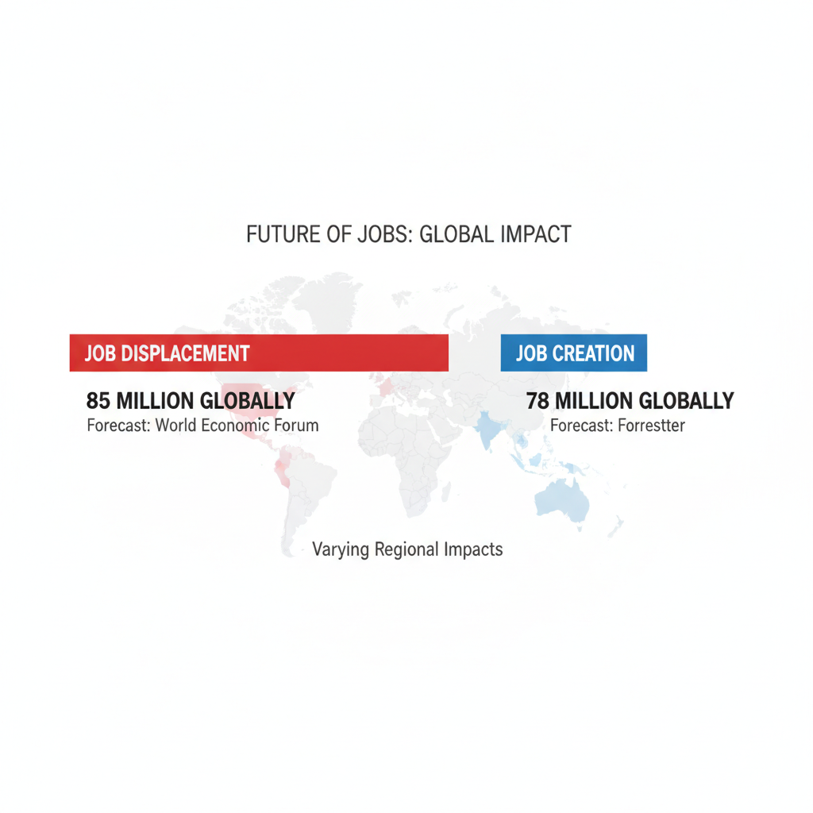
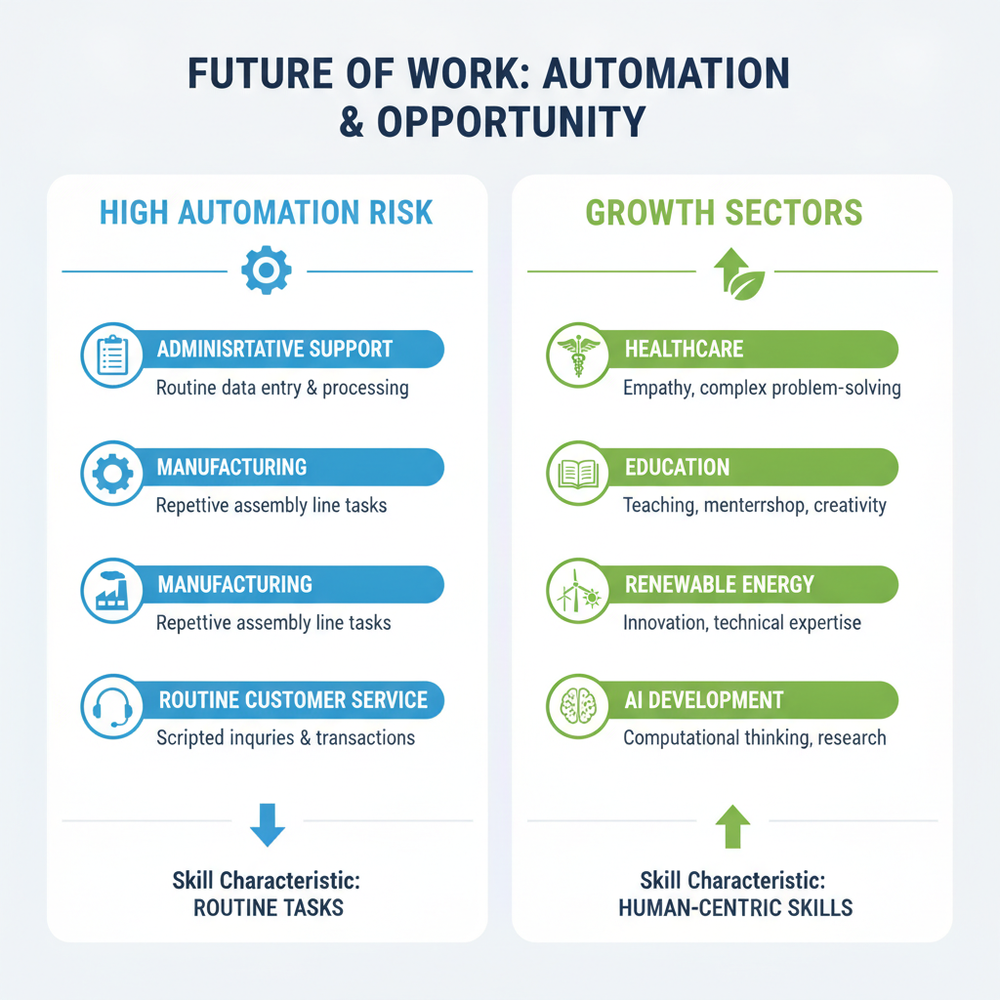
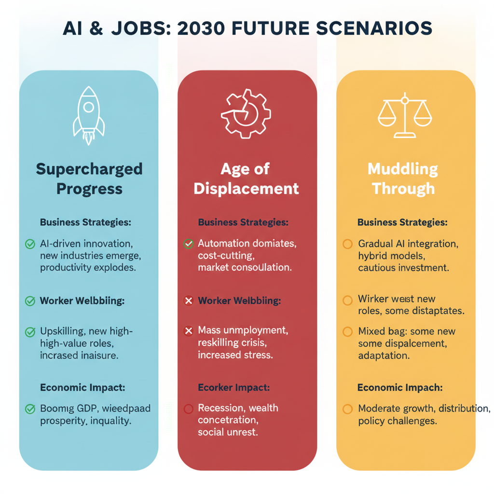

# How AI Will Impact Jobs in 2030: Trends, Predictions, and Implications

## Overview of AI-Driven Job Impact Predictions by 2030

Leading global forecasts present a complex picture of AI’s impact on jobs by 2030, combining both significant displacement with notable creation of new roles. The World Economic Forum (WEF) projects that by 2030, AI and automation will displace approximately 85 million jobs worldwide, while simultaneously enabling 78 million new roles—resulting in a near net-zero change but requiring urgent workforce reskilling (
*Projected global job displacement and creation by AI and automation by 2030 according to major forecasts.*). Forrester offers a US-specific estimate stating that AI and automation will replace about 6% of US jobs by 2030, highlighting a significant but proportionally smaller disruption compared to the global scale ([Source](https://www.forrester.com/blogs/ai-and-automation-will-take-6-of-us-jobs-by-2030)).  

It is important to distinguish between full job elimination and task automation within jobs. While entire jobs may vanish—commonly in routine, repetitive roles—many current positions will instead be transformed, with AI automating specific tasks rather than replacing the worker entirely. This means many roles will evolve requiring workers to adapt by focusing on tasks that demand human skills such as creativity, complex problem-solving, and interpersonal communication ([Source](https://www.davron.net/ai-job-replacement-statistics-2025-2030)).  

Geographically, the impact varies: the US faces moderate displacement with opportunities emerging in AI management, software engineering, and data analysis. Globally, developing economies may experience higher displacement risk in manufacturing and administrative sectors due to automation. Meanwhile, regions investing in AI-driven industries could see growth in AI-related occupations, boosting workforce participation but also demanding large-scale upskilling programs ([Source](https://reports.weforum.org/docs/WEF_Four_Futures_for_Jobs_in_the_New_Economy_AI_and_Talent_in_2030_2025.pdf)).  

Overall, workforce participation may shift substantially. Many workers will transition to new roles supported by AI tools, while others may require governmental and organizational intervention to mitigate unemployment risks. The labor market is expected to become more dynamic, demanding continuous learning and adaptation as AI changes the nature of work rather than simply shrinking the total number of jobs ([Source](https://www.weforum.org/stories/economic-growth/four-ways-ai-impact-job-markets)).  

These forecasts underscore the critical need for strategic workforce planning to prepare for AI-driven transformations by 2030.

## Sectors Most Affected by AI Automation and Transformation

AI-driven automation is reshaping the labor market with a marked divide between vulnerable and resilient sectors by 2030. Several industries feature prominently with high automation potential, particularly those relying heavily on repetitive and rule-based tasks. These include administrative support roles such as data entry, clerical work, and routine customer service functions. Manufacturing remains another prime sector, where AI-powered robotics and process optimization reduce the need for manual assembly and repetitive physical tasks. These trends are expected to affect millions of workers worldwide, as routine cognitive and physical tasks are increasingly outsourced to AI systems (
*Sectors most vulnerable to AI automation (e.g., manufacturing, admin support) versus sectors growing due to AI (e.g., healthcare, education, renewable energy).*).

In contrast, growth is projected in sectors that harness human-centric skills and emerging technologies. Healthcare is a significant growth area, driven by aging populations and the increased need for personalized care, diagnostics, and treatment planning augmented by AI. Education similarly will evolve, emphasizing lifelong learning and AI literacy, where teachers and trainers augment AI tools. Renewable energy, with its demand for innovation in sustainable technologies and infrastructure, and technology-related jobs, including AI development and maintenance themselves, are forecast to expand strongly ([Source](https://www.weforum.org/press/2025/01/future-of-jobs-report-2025-78-million-new-job-opportunities-by-2030-but-urgent-upskilling-needed-to-prepare-workforces)).

A crucial factor influencing job security amid automation is the nature of required skills. Roles demanding creativity, critical thinking, emotional intelligence, and complex problem-solving are less susceptible to replacement. AI excels at pattern recognition and routine tasks but struggles to replicate nuanced human judgment and empathy. For example, professions such as psychologists, creative professionals, or senior managers who rely on strategic decision-making and interpersonal skills are least vulnerable ([Source](https://www.aeen.org/which-jobs-can-remain-secure-until-2030-despite-ai)).

When comparing impacts on entry-level white-collar jobs versus skilled professions, the former tends to face greater displacement risk. Routine tasks in accounting, basic legal research, and administrative assistance are more likely to be automated rapidly. By contrast, skilled professionals such as engineers, clinicians, and senior analysts who integrate domain knowledge with judgment and experience will see less drastic direct AI replacement but will need to adapt to AI-augmented workflows ([Source](https://aimultiple.com/ai-job-loss)).

Gender and demographic factors also influence the unequal distribution of AI impacts. Sectors predominantly employing women, such as administrative work and retail, face higher automation exposure, potentially exacerbating existing workforce inequalities. Conversely, male-dominated sectors like technology currently offer more growth and resilience but may face transformation requiring upskilling. Younger workers might adapt more quickly to new skills, while older employees could experience greater displacement risks without targeted retraining programs ([Source](https://www.innopharmaeducation.com/blog/the-impact-of-ai-on-job-roles-workforce-and-employment-what-you-need-to-know)).

In summary, understanding these sectoral and demographic nuances is vital for workforce planning. Prioritizing skill development in creativity, critical thinking, and emotional intelligence, alongside targeted support for vulnerable demographic groups, will be essential strategies for preparing the workforce for AI-driven transformation by 2030.

## AI's Role in Transforming Tasks Versus Replacing Entire Jobs

AI’s impact on the workforce increasingly centers around *partial workflow automation*, where specific routine or repetitive tasks within a job are automated rather than eliminating entire roles. This selective automation changes job content and elevates skill requirements for workers, who must increasingly focus on managing AI tools, complex decision-making, and creative problem-solving. Rather than replacing workers outright, AI augments human capabilities, allowing employees to focus on higher-value activities.

For example, in customer service, AI-powered chatbots handle straightforward inquiries, freeing human agents to tackle nuanced cases and build customer relationships. In software development, AI can automate code formatting, bug detection, and testing — tasks that improve productivity without supplanting developers. Similarly, AI assists financial analysts by rapidly processing data and generating insights, enabling analysts to interpret results and advise strategy with greater impact.

Jobs vary significantly in their exposure to task-level substitution versus full displacement. Occupations involving highly repetitive tasks, such as data entry clerks or routine assembly line workers, are more vulnerable to task automation. But jobs demanding complex interpersonal skills, creativity, and critical thinking — like teachers, healthcare providers, or engineers — are less likely to be fully replaced. Instead, these roles will evolve as AI redefines their task mix and workflows.

This dynamic points toward a broader trend of *job evolution* rather than mass elimination. According to multiple forecasts, many existing occupations will persist but require adaptation and upskilling to collaborate effectively with AI systems ([Source](https://www.weforum.org/press/2025/01/future-of-jobs-report-2025-78-million-new-job-opportunities-by-2030-but-urgent-upskilling-needed-to-prepare-workforces)). The emphasis shifts toward continuous learning and hybrid human-AI workflows.

For developers and technology professionals, this creates substantial opportunities to build AI tools that *augment* rather than replace human workers. Designing AI solutions that enhance productivity, empower decision-making, and integrate smoothly with human tasks will be critical for workforce transformation in 2030. By focusing on augmentation, developers help future-proof jobs and contribute to a more collaborative human-AI future ([Source](https://ptrtraining.com/ai-future-of-work-2030)).

In summary, AI reshapes the workforce primarily through task automation within jobs, driving job transformation and skill evolution over pure job elimination. This nuanced impact calls for strategic workforce planning emphasizing human-AI collaboration and the development of augmentation technologies.

## Emerging and New Jobs Created by AI by 2030

Advances in AI technology are not only automating existing tasks but also creating entirely new categories of employment. By 2030, the workforce landscape will be significantly reshaped around AI infrastructure, data-centric roles, and emerging ethical frameworks.

**New Job Categories Around AI Infrastructure and Ethics**  
As organizations deploy increasingly complex AI systems, demand will surge for specialists who design, maintain, and govern these infrastructures. Key roles include:

- **AI Infrastructure Engineers**: Professionals building scalable, secure, and efficient AI platforms, integrating cloud and edge computing technologies.  
- **Data Scientists and AI Model Trainers**: Experts curating high-quality datasets, refining algorithms, and improving machine learning efficacy.  
- **AI Ethics and Compliance Officers**: New positions focusing on bias mitigation, transparency, and regulatory adherence to ensure responsible AI use.  

These roles reflect the growing recognition that AI needs robust technical and ethical oversight.  

**Growth in Creative, Strategic, and Human-Centered Roles**  
While some routine tasks are automated, AI will enhance demand for jobs emphasizing creativity, strategy, and human interaction. Roles requiring advanced cognitive skills—such as AI-assisted designers, strategic analysts, and human-AI interaction specialists—will expand. These jobs leverage AI for data-driven insights and augment human judgment, blending technical fluency with domain expertise.  

**Estimates of Millions of New AI-Driven Jobs Globally**  
According to the *Future of Jobs Report 2025* by the World Economic Forum, AI-driven industries are expected to create approximately 78 million new jobs worldwide by 2030, offsetting displacement in other sectors. These jobs span industries such as healthcare, finance, manufacturing, and education, as AI technologies become integral to diverse business models ([Source](https://www.weforum.org/press/2025/01/future-of-jobs-report-2025-78-million-new-job-opportunities-by-2030-but-urgent-upskilling-needed-to-prepare-workforces)).  

**Role of Reskilling and Upskilling in Workforce Transitions**  
The transition into AI-created roles will heavily depend on concerted reskilling efforts. Workers need to acquire skills in AI literacy, data analysis, and digital collaboration to remain competitive. Governments and enterprises must invest in continuous learning programs to equip employees with capabilities for AI infrastructure, ethical oversight, and creative problem-solving. Without this, talent shortages may bottleneck AI adoption and economic gains ([Source](https://www.gov.uk/government/publications/ai-skills-for-life-and-work-labour-market-and-skills-projections/ai-skills-for-life-and-work-labour-market-and-skills-projections)).  

**Examples of Jobs Integrating AI Technologies**  
Several emerging occupations integrate AI tools as core components of their workflows, illustrating the collaborative role of humans and AI:  

- **AI-Augmented Healthcare Practitioners**: Utilizing AI diagnostics and personalized treatment planning to improve patient outcomes.  
- **Data-Driven Marketing Strategists**: Combining consumer insights with AI-generated trend analysis to craft adaptive campaigns.  
- **Smart Manufacturing Specialists**: Overseeing AI-enabled automation systems while ensuring flexibility and quality control.  
- **Human-AI Interaction Designers**: Creating intuitive interfaces that facilitate seamless cooperation between users and AI agents.  

These roles highlight how AI will serve as both a tool and a partner, fundamentally transforming job content rather than merely replacing roles.  

In summary, the jobs landscape by 2030 will be characterized by a proliferation of new AI-centric roles, growing opportunities for strategic and creative positions, and an imperative for workforce adaptability through reskilling. Organizations and policy makers must proactively prepare for these shifts to harness AI’s full potential while supporting sustainable employment growth.

## Challenges and Considerations for Workforce Transitions and Policy

As AI adoption accelerates toward 2030, workforce transitions will face significant challenges stemming from uneven impacts across industries, job types, and regions. One key concern is the potential exacerbation of inequality and talent shortages. AI tends to automate routine and manual tasks more readily, disproportionately affecting lower-skilled and less adaptable professions, often concentrated in specific geographic areas. Conversely, high-tech and AI-augmented roles grow, creating demand for advanced skills that many current workers lack. This fragmentation can widen socio-economic divides and leave behind entire communities if not carefully managed ([Source](https://www.weforum.org/press/2025/01/future-of-jobs-report-2025-78-million-new-job-opportunities-by-2030-but-urgent-upskilling-needed-to-prepare-workforces)).

Addressing these challenges requires coordinated collaboration among governments, businesses, and educational institutions. Effective upskilling programs must be scalable, inclusive, and aligned with rapidly evolving AI-driven labor market needs. Public-private partnerships can help design curricula that integrate AI literacy and digital competencies into lifelong learning frameworks. Investments in reskilling should prioritize adaptable, cross-disciplinary skills to prepare workers for roles AI cannot easily replicate, such as creative problem solving, emotional intelligence, and complex communication ([Source](https://www.gov.uk/government/publications/ai-skills-for-life-and-work-labour-market-and-skills-projections/ai-skills-for-life-and-work-labour-market-and-skills-projections)).

Social safety nets play a critical role in cushioning displacement impacts and maintaining social cohesion. Policymakers are increasingly exploring measures like wage insurance, unemployment benefits tied to retraining, and portable benefits for gig and freelance workers. Equally important is the ethical adoption of AI by organizations to ensure transparency, fairness, and accountability in decision-making processes affecting employment. This includes avoiding biases in AI hiring tools and safeguarding worker privacy, which is essential for trust and equitable access to new opportunities ([Source](https://unric.org/en/ai-and-the-future-of-work-disruptions-and-opportunitie)).

To prepare for AI-driven labor changes, strategic policy planning frameworks are emerging that integrate scenario analysis and forecast modeling. These policies emphasize agility in labor market regulation, data-driven monitoring of AI impacts, and incentives for continuous workforce development. Governments may implement adaptive labor standards and support innovation clusters that enable local economies to pivot as AI reshapes industries. Additionally, international cooperation will be needed to manage cross-border talent flows and avoid competitive disadvantages caused by uncoordinated AI policies ([Source](https://reports.weforum.org/docs/WEF_Four_Futures_for_Jobs_in_the_New_Economy_AI_and_Talent_in_2030_2025.pdf)).

Potential failure modes remain a significant risk. A lack of timely adaptation—whether due to political inertia, insufficient funding for reskilling, or misaligned educational systems—could lead to widespread unemployment and economic instability. Overestimating AI’s short-term effects might reduce urgency, while underestimating long-term shifts may leave the workforce unprepared. Poor investment in upskilling programs could exacerbate talent shortages in growth sectors, stalling innovation. Therefore, proactive, evidence-based workforce planning and inclusive policy measures are essential to harness AI’s benefits while mitigating adverse employment consequences ([Source](https://ptrtraining.com/ai-future-of-work-2030)).

## Skills Developers and Workers Should Focus on to Thrive in 2030

As AI transforms the labor market by 2030, certain technical and human-centric skills will become indispensable for developers and technology professionals aiming for career resilience and growth.

### Critical Technical Skills with Growing Demand

- **Artificial Intelligence and Machine Learning:** Proficiency in AI frameworks, model training, and deployment is fundamental. The ability to understand and build AI systems is among the fastest-growing skill sets ([WEF Future of Jobs Report](https://www.weforum.org/press/2025/01/future-of-jobs-report-2025-78-million-new-job-opportunities-by-2030-but-urgent-upskilling-needed-to-prepare-workforces)).
- **Big Data Analytics:** Skills in processing and interpreting vast datasets remain vital as data-driven decision-making scales across industries.
- **Programming and Software Development:** Mastery in languages popular for AI and automation, such as Python, R, and Julia, along with cloud and edge computing platforms, will be key.
- **Cybersecurity:** As AI integration increases, protecting systems from sophisticated cyber threats necessitates advanced cybersecurity knowledge ([GOV.UK AI Skills Projection](https://www.gov.uk/government/publications/ai-skills-for-life-and-work-labour-market-and-skills-projections))

### The Ongoing Importance of Human-Centric Skills

Despite rapid automation, uniquely human capabilities remain critical:

- **Creativity:** Innovating and applying AI-led solutions in new contexts cannot be fully automated.
- **Leadership and Communication:** Guiding hybrid human-AI teams, fostering collaboration, and articulating complex ideas clearly are crucial.
- **Emotional Intelligence:** Skills like empathy and social awareness will enable workers to manage interpersonal dynamics and customer relationships effectively ([Cal Lutheran Essential Skills](https://www.calmu.edu/the-future-of-work-essential-skills-students-need-by-2030)).

### Adaptability, Continuous Learning, and Human-AI Collaboration

- **Adaptability:** The evolving AI landscape demands agility to quickly assimilate new tools and workflows.
- **Continuous Learning:** Lifelong education is no longer optional; programs emphasizing upskilling in AI and related fields will dominate workforce development.
- **Human-AI Collaboration:** Success hinges on understanding AI’s capabilities and limits and designing workflows where AI complements human judgment and intuition ([WEF Four Futures for Jobs](https://reports.weforum.org/docs/WEF_Four_Futures_for_Jobs_in_the_New_Economy_AI_and_Talent_in_2030_2025.pdf)).

### Preparing Developers to Build AI Tools Complementing Human Roles

- Emphasize ethical AI design and transparency to maintain trust and accountability.
- Develop skills in user experience (UX) tailored to AI interfaces for seamless human-AI interaction.
- Engage in multidisciplinary learning combining domain knowledge, AI techniques, and behavioral sciences.
- Participate in agile and iterative development environments to refine AI systems responsive to real-world human needs ([PTR Training](https://ptrtraining.com/ai-future-of-work-2030)).

### Studies Highlighting Skill Shifts and Educational Priorities

Multiple forecasts underscore a paradigm shift in skill demand by 2030:

- The **World Economic Forum** projects 78 million new AI-related jobs globally but stresses urgent upskilling efforts to fill these roles.
- **Forrester Research** estimates 6% of US jobs will be displaced by AI and automation, predominantly in routine roles, while new jobs will require hybrid technical and interpersonal capabilities.
- Government and academic reports highlight the criticality of STEM education paired with creativity and socio-emotional skills to prepare the future workforce ([AI Job Replacement Statistics](https://www.davron.net/ai-job-replacement-statistics-2025-2030)).

In summary, thriving in the AI-driven economy of 2030 demands a balanced portfolio of advanced technical know-how and deeply human skills, anchored by an adaptable mindset committed to continuous learning and collaboration with AI systems.

## Possible Future Scenarios for AI and Jobs in 2030

As we approach 2030, experts envision several distinct scenarios for how AI may reshape the workforce, each with unique implications for workers, businesses, and the economy (
*Overview diagram of three AI and jobs scenarios for 2030: Supercharged Progress, Age of Displacement, and Muddling Through, highlighting impacts on business strategies, worker wellbeing, and economic outcomes.*).

### Supercharged Progress

In this optimistic scenario, AI breakthroughs accelerate exponentially, generating new industries and occupations that compensate for the jobs AI automates. Advances in AI catalyze innovation in healthcare, green energy, and creative sectors, creating high-skill, meaningful roles. Workplaces become augmented environments where humans and AI collaborate, enhancing productivity and job satisfaction. Economic growth accelerates, driven by AI-enabled efficiencies and novel market opportunities.

- **Business strategies:** Prioritize investment in AI-augmented tools and continuous skills development.
- **Worker wellbeing:** Shifts toward higher-value tasks, requiring lifelong learning.
- **Economic impact:** Broad-based growth with reduced unemployment.

### Age of Displacement

Conversely, a pessimistic outlook foresees rapid AI-driven automation decimating many routine and even some cognitive jobs, leading to widespread unemployment and economic inequality. Without sufficient social safety nets or retraining programs, worker displacement intensifies, particularly impacting low- and medium-skilled workers.

- **Business strategies:** Focus primarily on cost-cutting through automation.
- **Worker wellbeing:** Elevated insecurity, wage pressure, and regional disparities.
- **Economic impact:** Potential stagnation or recession driven by suppressed consumer demand ([Source](https://www.forrester.com/blogs/ai-and-automation-will-take-6-of-us-jobs-by-2030)).

### Muddling Through

A majority of forecasts predict a balanced scenario where AI leads to both destruction and creation of jobs, resulting in net workforce transformation rather than massive displacement or unprecedented growth. Here, AI automates repetitive tasks but simultaneously spurs new roles in AI oversight, data analysis, and creative problem solving. The rate of change challenges education and training systems but allows adaptation through workforce reskilling ([Source](https://jfsdigital.org/wp-content/uploads/2017/01/JFS212Final%EF%BC%88%E5%B7%B2%E6%8B%96%E7%A7%BB%EF%BC%89-6.pdf)).

- **Business strategies:** Emphasize flexibility, investing in retraining and human-AI collaboration.
- **Worker wellbeing:** Mixed experiences, with opportunities for some and challenges for others.
- **Economic impact:** Moderate growth with evolving labor market dynamics.

### Implications for Planning

Each scenario underscores the need for proactive workforce planning. Businesses must think beyond automation and invest in human capital, adapting HR and operational strategies to changing skill demands. Policymakers and leaders should focus on strengthening social protections and education systems to support displaced workers. Individuals must engage in continuous learning to sustain employability.

Ultimately, the trajectory depends significantly on decisions made today—whether we embrace responsible AI adoption fostering inclusive growth or allow technological disruption to exacerbate inequalities.

By considering these scenarios, technology professionals can better anticipate risks and opportunities, guiding strategic choices that shape a more resilient and equitable workforce future.