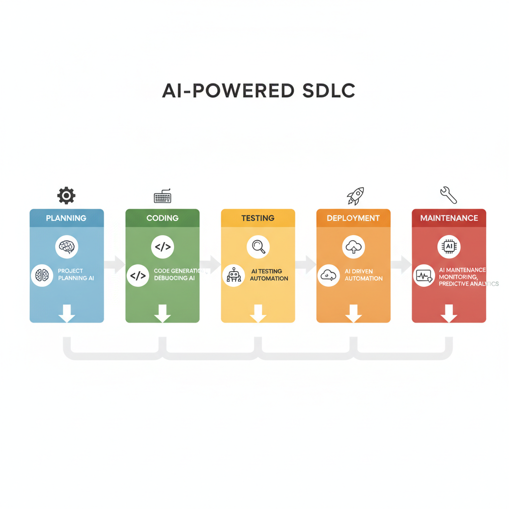
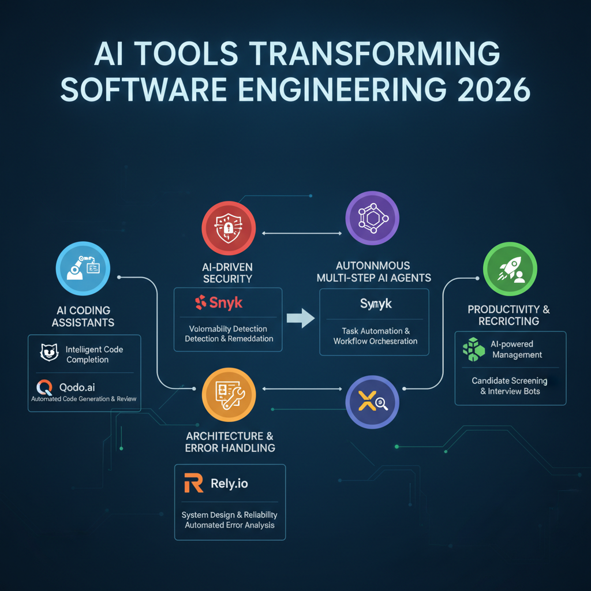
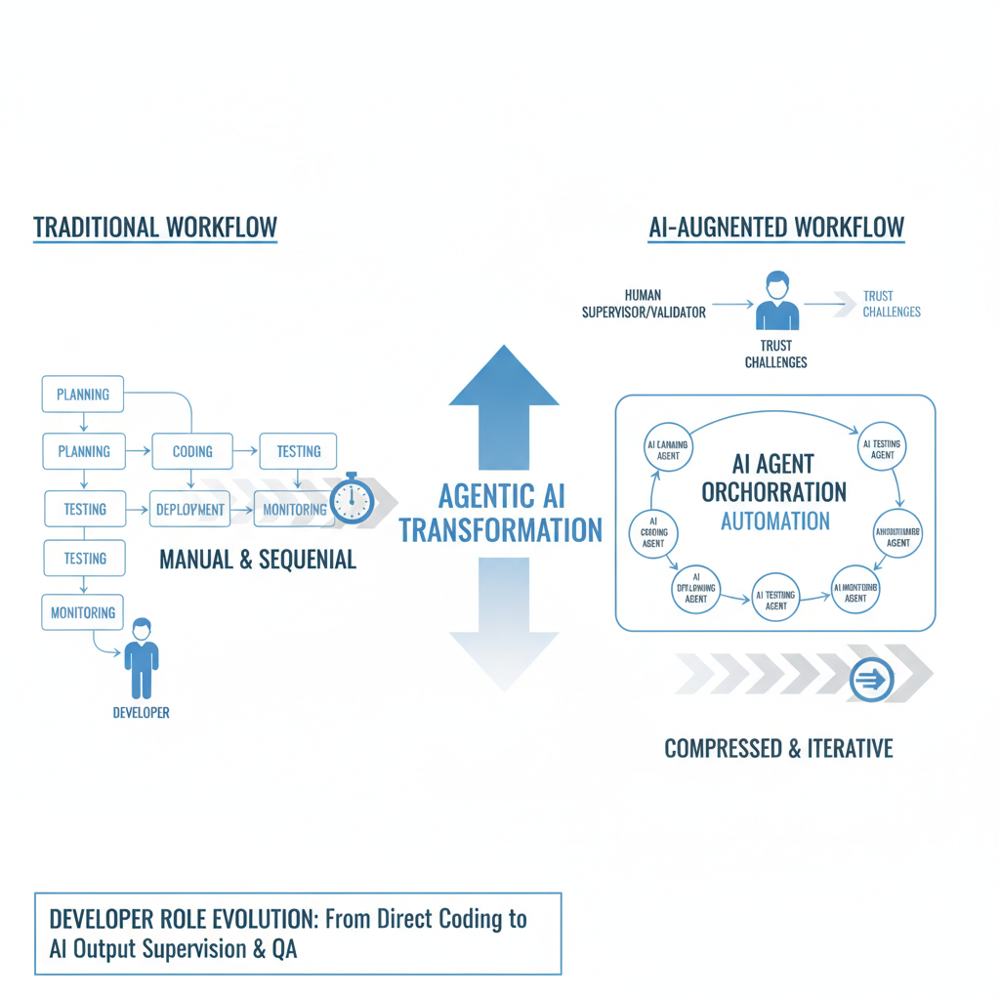

# How AI is Revolutionising Software Engineering in 2026

## Overview of AI Adoption in Software Engineering Workflows in 2026

AI adoption among software developers has surged dramatically in 2026, with recent data indicating that between 70% and 95% of developers actively use AI tools in their workflows. One comprehensive study reports AI integration in 97% of software development organizations worldwide, signaling near-ubiquity of AI-assisted development processes ([Source](https://futurumgroup.com/press-release/ai-reaches-97-of-software-development-organizations)). This wide adoption marks a pivotal shift in how development teams approach coding, testing, deployment, and maintenance.

### AI Presence Across the Software Development Life Cycle (SDLC)

AI is now embedded throughout all key SDLC phases:

- **Planning:** AI-driven project planning platforms analyze requirements and generate scalable architecture proposals, aiding software architects in early decision-making ([Source](https://rkoots.github.io/blog/ai/technology/engineering/2026/04/24/ai-tools-for-software-architecture-design-latest-updates-1777002192)).
- **Coding:** Intelligent code generation tools assist developers by producing boilerplate code snippets, refactoring suggestions, and language-specific syntax completions, significantly accelerating development speed ([Source](https://www.toolify.ai/jobs/software-engineering-teams-95184)).
- **Testing:** AI-enabled testing frameworks automate unit, integration, and regression tests with enhanced coverage and predictive bug detection, reducing manual test engineering workloads ([Source](https://digitaldefynd.com/IQ/ai-in-software-testing-case-studies)).
- **Deployment:** Continuous deployment pipelines integrate AI to optimize resource allocation, monitor anomaly detection, and automatically rollback faulty releases.
- **Maintenance:** AI systems proactively scan for security vulnerabilities, performance degradation, and code-quality issues, facilitating timely patches and updates ([Source](https://zaigoinfotech.com/blogs/impact-of-ai-on-software-development)).

*AI Integration Across Software Development Life Cycle (2026) highlighting Planning, Coding, Testing, Deployment, and Maintenance phases with AI roles.*

### Roles of AI Tools in Modern Software Engineering

The landscape of AI tools extends beyond code completion to span automation in critical tasks:

- **Code Generation & Refactoring:** AI produces context-aware code blocks, reducing repetitive tasks.
- **Testing Automation:** Automated test case creation and execution with AI identify edge cases often missed by manual testing.
- **Security Scanning:** AI-powered static and dynamic code analysis tools detect vulnerabilities and compliance issues in near real-time.
- **Project Planning:** Natural language processing (NLP) interfaces translate product requirements into development sprints, resource allocation, and risk assessment models.

### Changing Developer Interactions and Workloads

While AI boosts productivity, developer roles are evolving. The reliance on AI-generated code increases code review demands; developers now spend more time auditing AI outputs for correctness, security, and maintainability. This shift emphasizes human oversight to ensure AI recommendations meet quality standards ([Source](https://linearb.io/library/ai-in-software-development)).

Developers also adopt 7agentic AI5 assistants capable of autonomous task execution, further transforming workflows and necessitating new skills in AI supervision ([Source](https://www.cio.com/article/4134741/how-agentic-ai-will-reshape-engineering-workflows-in-2026.html)).

### Emerging Governance and Compliance Concerns

The widespread AI integration has raised governance challenges. Organizations face increasing scrutiny regarding:

- **Accountability:** Establishing clear responsibility pathways for AI-made decisions or code.
- **Compliance:** Ensuring AI tools comply with software licensing, data privacy regulations, and security standards.
- **Bias & Quality:** Monitoring AI outputs for biases or systemic errors that could propagate risks.

As a result, governance frameworks and AI audit trails are becoming critical components of responsible AI usage in software engineering ([Source](https://zaigoinfotech.com/blogs/impact-of-ai-on-software-development)).

---

In summary, 2026 sees AI deeply woven into every phase of software engineering. Developers benefit from enhanced productivity and automation but must adapt to increased oversight and emerging governance practices. Staying informed about AI capabilities and risks remains essential for forward-looking teams aiming to harness AI's full potential responsibly.

## Key AI Tools Transforming Software Engineering in 2026

The software engineering landscape in 2026 is profoundly shaped by an array of AI-powered tools that optimize coding, security, architecture design, and team productivity. Heres a focused look at the most influential AI tools driving this transformation:

### AI Coding Assistants: GitHub Copilot and Qodo.ai

Prominent AI coding assistants like **GitHub Copilot** and **Qodo.ai** are now indispensable in developer workflows. GitHub Copilot leverages large language models to provide real-time code suggestions, autocompletion, and even generate entire functions from comments or partial code snippets. Qodo.ai enhances this by offering context-aware code generation and optimization tailored for enterprise-grade projects. Both tools significantly speed up coding tasks, reduce boilerplate effort, and help maintain coding standards across teams ([Source](https://www.toolify.ai/jobs/software-engineering-teams-95184)).

### AI-Driven Security Integration: Snyk

Security automation has become seamlessly embedded within development workflows via AI-driven tools like **Snyk**. Snyk continuously scans codebases, dependencies, and container images to identify vulnerabilities early in the software development lifecycle (SDLC). Its AI models prioritize security risks based on exploitability and context, enabling developers to fix critical issues faster without disrupting their productivity. This integration ensures 7security as code5 is a native aspect of engineering pipelines, reducing release risk while aligning with agile practices ([Source](https://ipwithease.com/how-ai-is-reshaping-software-development)).

### Autonomous Multi-Step AI Agents

The rise of advanced **AI agents** capable of autonomous multi-step tasks has revolutionized the SDLC. Unlike traditional assistants, these agents can independently manage tasks that span requirement analysis, code generation, testing, deployment, and even post-release monitoring. Their autonomy allows them to chain workflows1such as generating code, performing automated tests, and iterating fixeswithout constant human intervention. This evolution is reshaping roles and workflows in engineering teams by augmenting human capabilities with scalable, agentic intelligence ([Source](https://www.cio.com/article/4134741/how-agentic-ai-will-reshape-engineering-workflows-in-2026.html), [Source](https://www.mygreatlearning.com/blog/ai-agents-replace-traditional-software-jobs)).

### AI Platforms for Software Architecture and Error Handling: Rely.io and XSpecs

Emerging platforms like **Rely.io** and **XSpecs** facilitate AI-driven software architecture design and robust error handling. Rely.io assists architects by generating system blueprints and scalable microservice designs from high-level requirements, accelerating initial design phases. XSpecs focuses on predicting error patterns and automating fault tolerance mechanisms using AI, enhancing system reliability. These tools reduce manual overhead in planning and debugging complex systems and enable more resilient software design through predictive analytics ([Source](https://rkoots.github.io/blog/ai/technology/engineering/2026/04/24/ai-tools-for-software-architecture-design-latest-updates-1777002192)).

### Productivity and Recruiting AI Tools

Beyond code and architecture, AI also optimizes **team productivity** and **hiring processes**. Tools are now widely used to analyze developer performance metrics, identify collaboration bottlenecks, and suggest workflow improvements. On the recruiting front, AI-powered platforms streamline candidate screening by evaluating skills, experience, and cultural fit at scale, allowing engineering leaders to hire rapidly without compromising quality. These AI enhancements enable more strategic team building and continuous performance optimization, critical in high-velocity product environments ([Source](https://foundr.ai/tools/software-engineering), [Source](https://www.bacancytechnology.com/blog/best-ai-tools-for-software-development)).

---

Together, these AI technologies form an ecosystem that accelerates software delivery, improves code quality, enhances security postures, and elevates team efficiency. Developers and leaders embracing these tools in 2026 stand to realize higher innovation velocity and more resilient software products.

*Visual summary of major AI-powered tools in software engineering including coding assistants, security scanners, autonomous agents, architecture platforms, and productivity tools.*

## Impact of Agentic AI on Engineering Workflows and Developer Roles

Agentic AI refers to autonomous artificial intelligence systems capable of independently handling complex software engineering processes, including planning, development, and code review. Unlike traditional AI tools that assist with isolated tasks, agentic AI orchestrates multi-step workflows, making decisions, generating code, and iteratively refining software components with minimal human intervention ([CIO.com](https://www.cio.com/article/4134741/how-agentic-ai-will-reshape-engineering-workflows-in-2026.html)).

This autonomy enables substantial compression of coordination overhead in development teams. Agentic AI systems can break down large projects into smaller tasks, assign priorities, and execute coding sequences without constant human input. This automation accelerates delivery cycles by eliminating delays inherent in manual handoffs and dependency management. For example, tasks such as feature implementation, testing, and documentation generation can be completed in parallel or in optimized order, dramatically speeding up the software development lifecycle ([ipwithease.com](https://ipwithease.com/how-ai-is-reshaping-software-development)).

With agentic AI taking over routine and repetitive activities, developer roles are shifting significantly. Instead of writing code line-by-line, engineers increasingly focus on supervising AI outputs, validating correctness, and guiding system improvements. This new role emphasizes higher-level problem-solving, quality assurance, and strategic decision-making. Developers serve as 7AI supervisors,5 ensuring that agentic AI5s autonomous actions align with project goals and governance standards ([mygreatlearning.com](https://www.mygreatlearning.com/blog/ai-agents-replace-traditional-software-jobs)).

However, this shift is not without friction. Surveys and reports reveal persistent distrust among developers toward agentic AI5s reliability and interpretability. The opacity of AI-generated code and decisions often leads to increased scrutiny, creating new review bottlenecks that can slow down integrations and deployments. Developers tend to spend more time auditing and testing AI-produced artifacts, which can counterbalance some workflow gains. Addressing trust through improved transparency, audit trails, and governance protocols is therefore a critical focus area ([ipwithease.com](https://ipwithease.com/how-ai-is-reshaping-software-development)).

Reflecting these challenges and opportunities, many software engineering internships and research initiatives in 2026 prioritize advancing agentic AI workflows. Intern programs at leading tech firms explicitly target enhancing AI autonomy, reducing human bottlenecks, and integrating robust oversight mechanisms. Research is also intensifying on developing explainable AI models and creating collaborative frameworks where humans and agentic AI systems interact seamlessly throughout the development process ([hitmarker.net](https://hitmarker.net/jobs/nvidia-software-engineering-intern-ai-tools-fall-2026-1706478)).

In summary, agentic AI profoundly transforms engineering workflows by automating multi-step tasks and compressing coordination, while simultaneously transforming developer roles into more supervisory and validation-oriented positions. The technology5s success depends heavily on overcoming trust deficits and optimizing governance, promising a future where human and AI collaboration drives faster, higher-quality software delivery.

## Challenges and Failure Modes in AI-Augmented Software Engineering

Despite the transformative potential of AI in software engineering, several persistent challenges and failure modes have surfaced as the technology matured in 2026. Understanding these issues is crucial for developers and engineering leaders integrating AI tools into their workflows.

### Increased Code Review Load from AI-Generated Pull Requests

One significant operational challenge is that AI-generated pull requests often add to the existing code review burden rather than reducing it. Because AI tools generate numerous candidate solutions or refactorings, human reviewers face a doubled workload verifying these changes for correctness and style compliance. This surge in review tasks slows down development pipelines and can lead to reviewer fatigue, undermining the promise of AI-driven productivity gains ([Source](https://ipwithease.com/how-ai-is-reshaping-software-development)).

### Developer Distrust in AI Outputs

A recurring theme among developers in 2026 is skepticism toward AI-generated code. This distrust stems from occasional inaccuracies, lack of contextual understanding by AI models, and opaque reasoning behind certain suggestions. Developers report hesitancy to fully trust AI without manual vetting, which slows adoption and integration efforts. Building confidence requires better transparency and explainability in AI outputs ([Source](https://linearb.io/library/ai-in-software-development)).

### Key Failure Modes in AI-Augmented Development

AI tools in software engineering encounter several failure modes that teams must vigilantly manage:

- **Incorrect Code Generation:** AI models sometimes produce syntactically valid but logically flawed code, which can introduce subtle bugs if unchecked.
- **Missed Security Vulnerabilities:** While AI can assist in detecting issues, it can also overlook critical security flaws or generate insecure code patterns, demanding thorough security auditing.
- **Deployment Errors:** Automated deployment scripts crafted by AI may misconfigure environments or omit necessary validation steps, leading to faulty rollouts ([Source](https://devessence.com/blog/!/78/ai-in-software-development-2026-sdlc-impact-real-productivity-data-whats-next)).

### Governance, Compliance, and Human Oversight

The integration of AI-generated code into production systems necessitates stringent governance frameworks and compliance adherence. Organizations have established policies requiring human oversight at every stage of AI-assisted development to mitigate risk. This includes:

- Enforcing mandatory code reviews by experienced engineers.
- Maintaining audit trails for AI contributions to ensure accountability.
- Aligning AI utilization with regulatory and industry standards to avoid compliance violations ([Source](https://zaigoinfotech.com/blogs/impact-of-ai-on-software-development)).

### Observability and Monitoring in AI-Assisted Architecture

Another critical aspect is the deployment of enhanced observability and monitoring practices, especially when AI contributes to software architecture design. AI-assisted designs can introduce novel dependencies and abstractions that are challenging to track with traditional tools. Real-time monitoring and telemetry are vital to:

- Detect performance regressions or unexpected behaviors.
- Alert on anomalies possibly caused by AI-generated components.
- Provide insights for iterative improvement of AI models and architectural decisions ([Source](https://rkoots.github.io/blog/ai/technology/engineering/2026/04/24/ai-tools-for-software-architecture-design-latest-updates-1777002192)).

---

By acknowledging and addressing these challenges proactively, software teams can harness AI5s benefits while safeguarding quality, security, and reliability in their development processes.

## Performance and Cost Considerations for AI Tools in Software Engineering

The integration of AI tools in software engineering workflows in 2026 brings a complex interplay of performance enhancements and cost implications. While AI-driven code generation significantly accelerates development, it also introduces overhead in code review and validation efforts. Developers report productivity gains from AI assistance, but these are partially offset by time invested in verifying AI-generated outputs to maintain code quality and security ([How AI is Reshaping Software Development in 2026](https://ipwithease.com/how-ai-is-reshaping-software-development)).

Scalability presents another critical challenge. Advanced AI agents and platforms require substantial computational resources, which can strain infrastructure as teams scale up usage. Running real-time AI code assistants or automated refactoring agents demands high-performance cloud environments or dedicated on-premise GPUs, increasing resource consumption and potentially causing latency under heavy loads ([How agentic AI will reshape engineering workflows in 2026](https://www.cio.com/article/4134741/how-agentic-ai-will-reshape-engineering-workflows-in-2026.html)).

Moreover, the adoption of AI-driven security scanning and automated testing tools introduces recurring costs. Continuous integration pipelines equipped with AI-based vulnerability detection and quality assurance improve software reliability but necessitate investments in licensing, integration, and monitoring. These tools often add to build times, influencing overall pipeline efficiency and operational expenses ([AI in Software Testing [5 Case Studies] [2026]](https://digitaldefynd.com/IQ/ai-in-software-testing-case-studies)).

Cost-benefit balances vary widely between enterprises and startups. Large organizations can absorb the higher capital expenditures on AI infrastructure and benefit from long-term ROI via enhanced code quality and reduced time to market. In contrast, startups face tighter budgets and must weigh upfront AI tool costs against the potential acceleration of development cycles. Careful selection of scalable, pay-as-you-go AI platforms helps mitigate financial risks while still leveraging productivity gains ([Best AI Development Platforms in 2026 (Compared)](https://www.omniflowai.com/blog/ai-development-platforms)).

Finally, AI tools are reshaping project timelines and resource allocation strategies. Early-stage projects benefit from rapid prototyping with AI coding assistants, compressing schedule estimations. However, project managers must allocate time for human oversight of AI outputs and maintain skilled personnel to handle complex edge cases AI cannot resolve autonomously. Balancing AI automation with expert review ensures predictable delivery without compromising code integrity ([Impact of AI on Software Development in 2026 Explained](https://zaigoinfotech.com/blogs/impact-of-ai-on-software-development)).

In summary, AI tools present both compelling performance benefits and nuanced cost factors. The key to maximizing value lies in mindful integration that optimizes resource use, scales effectively, and aligns with the specific needs of the development environment.

## Security and Privacy Implications of AI Integration in Software Development

In 2026, AI integration is deeply embedded within the software development lifecycle (SDLC), especially through AI-powered security scanning tools like Snyk and other advanced platforms. These tools automatically detect vulnerabilities by analyzing code in real-time, enabling developers to remediate security issues earlier and more efficiently than traditional methods ([Source](https://www.toolify.ai/jobs/software-engineering-teams-95184)). This seamless integration enhances continuous security testing, reducing the window of exposure and supporting DevSecOps practices.

However, an overreliance on AI for vulnerability detection carries risks. AI models, while sophisticated, can miss novel or complex attack vectors that require human intuition and context understanding. Blind trust in automated fixes may also introduce unintentional weaknesses or overlook the need for architectural security improvements ([Source](https://rkoots.github.io/blog/ai/technology/engineering/2026/04/24/ai-tools-for-software-architecture-design-latest-updates-1777002192)). As such, security teams need to treat AI tools as augmentations rather than replacements for expert analysis.

Privacy concerns have risen from AI systems that process sensitive source code and proprietary data. Feeding critical assets into AI-powered cloud services or third-party platforms can expose intellectual property or confidential information if data governance is lax. Companies now prioritize rigorous data handling policies, encryption, and on-premises AI models to mitigate risks of data leakage ([Source](https://ipwithease.com/how-ai-is-reshaping-software-development)).

This shift has also altered security governance and compliance landscapes. Regulatory frameworks increasingly address AI-specific challenges such as auditability of AI-driven code changes and adherence to data protection laws in AI pipelines. Development organizations have responded by integrating AI transparency, logging, and explainability features to ensure compliance and enable effective risk management in AI-augmented environments ([Source](https://devessence.com/blog/!/78/ai-in-software-development-2026-sdlc-impact-real-productivity-data-whats-next)).

To secure AI-augmented pipelines effectively, best practices have emerged:

- Combine AI scanning with manual code reviews and penetration testing.
- Implement strict data governance policies for AI training and inference.
- Use encrypted and isolated environments for AI processing of sensitive code.
- Maintain clear audit trails and transparency reports for AI-driven changes.
- Continuously monitor AI tool outputs for false positives/negatives and retrain models regularly.

By adopting these strategies, development teams can harness AI5s security benefits while mitigating associated risks, preserving both software robustness and user privacy in 20265s increasingly AI-driven engineering workflows.

## Future Outlook: Preparing for Continued AI Evolution in Software Engineering

In 2026, AI platforms like Google Vertex AI and Azure Machine Learning are rapidly advancing, offering more robust, scalable solutions tailored for enterprise software development. These platforms increasingly integrate automated workflows, advanced model tuning, and seamless deployment capabilities, enabling engineering teams to embed AI deeply into their SDLC processes ([Omniflow Blog](https://www.omniflowai.com/blog/ai-development-platforms)). The ongoing enhancement of such platforms is a clear signal that AI-driven development will become even more central to software engineering practices.

To harness these advancements effectively, developers must prioritize AI literacy, not just as optional knowledge but as a core competency. Mastering AI workflows1ranging from data preparation to model integrationdirectly correlates with increased productivity and code quality. Familiarity with AI-centric development tools enhances a developer5s ability to debug, optimize, and innovate within AI-powered environments, setting apart those who adapt quickly from those who fall behind ([daily.dev](https://daily.dev/blog/ai-keep-up-guide-for-developers)).

Alongside these platform improvements, the ecosystem of AI tools continues to expand beyond coding assistance. Emerging AI-driven applications span recruitment and talent matching, automated UI/UX design, and productivity enhancements like intelligent code review and documentation generation. This broad toolset transforms many phases of software development, making teams more agile and accelerating time-to-market ([Toolify](https://www.toolify.ai/jobs/software-engineering-teams-95184), [RKoots](https://rkoots.github.io/blog/ai/technology/engineering/2026/04/24/ai-tools-for-software-architecture-design-latest-updates-1777002192)).

These shifts also reshape team dynamics significantly. The rise of AI governance roles is notable, with specialists focusing on ethical AI use, bias mitigation, security concerns, and compliance. Traditional roles evolve to include oversight of AI-generated code and validation of autonomous agents' output, requiring new collaboration frameworks oriented around AI accountability and review ([CIO](https://www.cio.com/article/4134741/how-agentic-ai-will-reshape-engineering-workflows-in-2026.html)). Organizations investing in these interdisciplinary roles gain a competitive edge by balancing innovation with reliability.

For developers and engineering leaders aiming to thrive amid this transformation, proactive engagement is essential. Regularly exploring emergent AI tools, contributing to AI governance discussions, and upskilling in machine learning concepts will be decisive in maintaining competitive advantage. Staying abreast of AI's rapid evolution and integrating it thoughtfully into engineering workflows ensures teams remain efficient, innovative, and prepared for the future landscape of software development ([Futurum Group](https://futurumgroup.com/press-release/ai-reaches-97-of-software-development-organizations)).

In summary, 20265 AI evolution encourages a forward-looking mindset: embrace continuous learning, adapt team structures to include AI oversight, and leverage emerging platforms and tools. This approach will empower software engineers to harness AI5s full potential responsibly and sustainably.

*Diagram showing how agentic AI automates multi-step engineering workflows and shifts developer roles towards supervision and validation in 2026.*